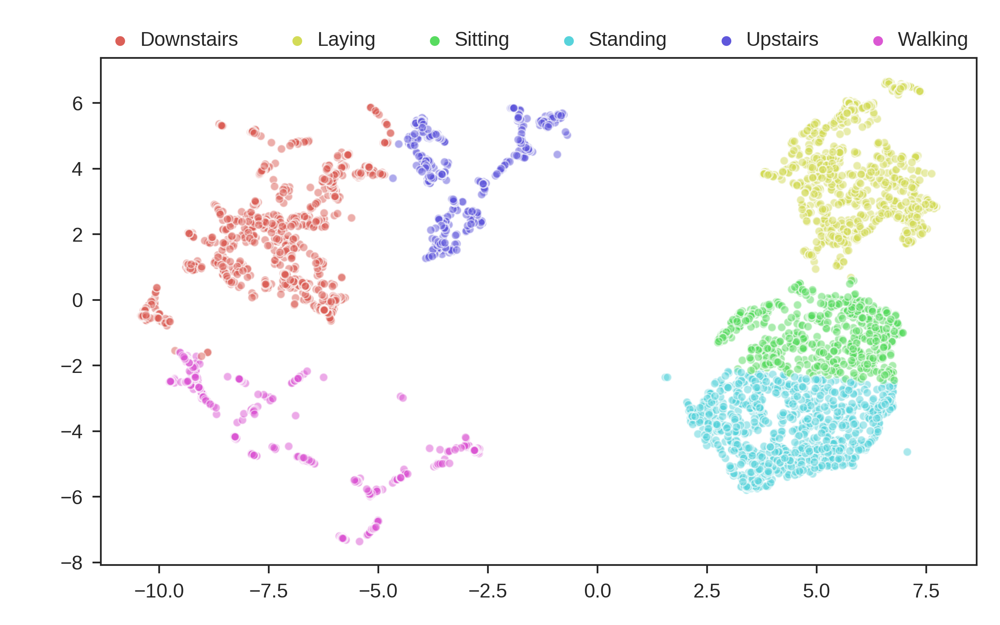

# Not Too Deep Clustering

This is a library implementation of [n2d](https://github.com/rymc/n2d). To learn more about N2D, and clustering manifolds of autoencoded embeddings, please refer to the [amazing paper](https://arxiv.org/abs/1908.05968) published August 2019.

## What is it?

Not too deep clustering is a state of the art "deep" clustering technique, in which first, the data is embedded using an autoencoder. Then, instead of clustering that using some deep clustering network, we use a manifold learner to find the underlying (local) manifold in the embedding. Then, we cluster that manifold. In the paper, this was shown to produce high quality clusters without the standard extreme feature engineering required for clustering.

In this repository, a framework for A) reproducing the study and B) extending the study is given, for further research and use in a variety of applications

# Installation

N2D is [available on pypi](https://pypi.org/project/n2d/)

```sh
pip install n2d
```

# Usage

First, lets load in some data. In this example, we will use the Human Activity Recognition(HAR) dataset. In this dataset, sets of time series with data from mobile devices is used to classify what the person is doing (walking, sitting, etc.)

```python
import datasets as data
x,y, y_names = data.load_har()
```

Next, lets set up our deep learning environment, as well as load in necessary libraries:

```python
import os
import random as rn
import numpy as np

import matplotlib
import matplotlib.pyplot as plt
import seaborn as sns
plt.style.use(['seaborn-white', 'seaborn-paper'])
sns.set_context("paper", font_scale=1.3)
matplotlib.use('agg')

import tensorflow as tf
from keras import backend as K

# set up environment
os.environ['PYTHONHASHSEED'] = '0'


rn.seed(0)

np.random.seed(0)
```

Finally, we are ready to get clustering!

```python
import n2d as nd

n_clusters = 6  #there are 6 classes in HAR

# Initialize everything
harcluster = nd.n2d(x, nclust = n_clusters)
```

The first step in using this framework is to initialize an n2d object with the dataset and the number of clusters. The primary purpose of this step is to set up the autoencoder for training.

Next, we pretrain the autoencoder. In this step, you can fiddle with batch size etc. On the first run of the autoencoder, we want to include the weight_id parameter, which saves the weights in `weights/`, so we do not have to train the autoencoder repeatedly during our experiments.

```python
harcluster.preTrainEncoder(weight_id = "har")
```

The next time we want to use this autoencoder, we will instead use the weights argument:

```python
harcluster.preTrainEncoder(weights = "har-1000-ae_weights.h5")
```

The next important step is to define the manifold clustering method to be used:

```python
manifoldGMM = nd.UmapGMM(n_clusters)
```

Now we can make a prediction, as well as visualize and assess

```python
harcluster.predict(manifoldGMM)
# predictions are stored in harcluster.preds
harcluster.visualize(y, y_names, dataset = "har", nclust = n_clusters)
print(harcluster.assess(y))
# (0.81212, 0.71669, 0.64013)
```

Before viewing the results, lets talk about the metrics. The first metric is cluster accuracy, which we see here is 81.2%, which is absolutely state of the art for the HAR dataset. The next metric is NMI, which is another metric which describes cluster quality based on labels, independent of the number of clusters. We have an NMI of 0.717, which is again absolutely state of the art for this dataset. The last metric, ARI, shows another comparison between the actual groupings and our grouping. A value of 1 means the groupings are nearly the same, while a value of 0 means they completely disagree. We have a value of 0.64013, which indicates that are predictions are more or less in agreement with the truth, however they are not perfect.



N2D prediction


Actual clusters

## Extending

So far, this framework only includes the method for manifold clustering which the authors of the paper deemed best, umap with gaussian mixture clustering. Lets say however we want to try out spectral clustering instead:

```python
from sklearn.cluster import SpectralClustering
import umap
class UmapSpectral:
    def __init__(self, nclust,
                 umapdim = 2,
                 umapN = 10,
                 umapMd = float(0),
                 umapMetric = 'euclidean',
		 random_state = 0
                 ):
        self.nclust = nclust
	# change this bit for changing the manifold learner
        self.manifoldInEmbedding = umap.UMAP(
            random_state = random_state,
            metric = umapMetric,
            n_components = umapdim,
            n_neighbors = umapN,
            min_dist = umapMd
        )
	# change this bit to change the clustering mechanism
	self.clusterManifold = SpectralClustering(
		n_clusters = nclust
		affinity = 'nearest_neighbors',
		random_state = random_state
	)


    def predict(self, hl):
    # obviously if you change the clustering method or the manifold learner
    # youll want to change the predict method too.
        hle = self.manifoldInEmbedding.fit_transform(hl)
        self.clusterManifold.fit(hle)
	y_pred = self.clusterManifold.fit_predict(hle)
        return(y_pred)
```

Now we can run and assess our new clustering method:

```python
manifoldSC = UmapSpectral(6)
harcluster.predict(manifoldSC)
print(harcluster.assess(y))
# (0.40946, 0.42137, 0.14973)
```

This clearly did not go as well, however we can see that it is very easy to extend this library. We could also try out swapping UMAP for ISOMAP, the clustering method with kmeans, or maybe with a deep clustering technique. 


# Roadmap

- [x] Package library
- [ ] Implement other promising methods
- [ ] Make assessment/visualization more extensible
- [ ] Documentation?
- [ ] Find an elegant way to deal with pre training weights
- [ ] Package on Nix
- [ ] Blog post?
